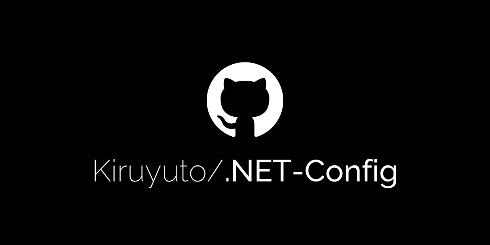

<p align="center">
  
</p>

<p align="center">
  Personal set of rules and analyzers distributed as a NuGet package to share configuration across .NET projects.
</p>

<p align="center">
  <sub>
    <strong>Heavily</strong> based on
    <a href="https://github.com/meziantou/">Gérald Barré (@Meziantou)</a>'s
    "<a href="https://www.meziantou.net/sharing-coding-style-and-roslyn-analyzers-across-projects.htm">Sharing coding style and Roslyn analyzers across projects</a>"
    post and his
    <a href="https://github.com/meziantou/Meziantou.DotNet.CodingStandard">CodingStandard</a>
    repository.<br>
    This config contains rules changed and fine-tuned to my personal and work needs as well as preferences.
  </sub>
</p>

## Usage
Add the [NuGet](https://www.nuget.org/packages/Kiruyuto.DotNet.Config/#versions-body-tab) package to your project, and the configs will be automatically imported.

> [!IMPORTANT]
> It is recommended to use `Directory.Build.props` in your project over per `.csproj` configuration

> [!WARNING]
> This package bans EF Core's `AddAsync` and `AddRangeAsync` by default.  
> Projects that intentionally rely on async value generators, such as `HiLo`, can disable only those two bans using:
> ```xml
> <Project>
>   <PropertyGroup>
>     <KiruyutoDotNetConfigEnableEntityFrameworkCoreAsyncAddBans>false</KiruyutoDotNetConfigEnableEntityFrameworkCoreAsyncAddBans>
>   </PropertyGroup>
> </Project>
> ```


## Structure overview
- Dependencies can be found in [Kiruyuto.DotNet.Config.csproj](./Kiruyuto.DotNet.Config.csproj)
- `.globalconfig` rule configurations are located in [`files/` directory](./Kiruyuto.DotNet.Config/files/)
- `.props` files are located in [`build/` directory](./Kiruyuto.DotNet.Config/build/). These are split into 'categories' for improved maintainability

## Building & Local testing
Run this command in the repository root to generate `.nupkg` file in `local-packages/` directory:
```bash
dotnet pack Kiruyuto.DotNet.Config/Kiruyuto.DotNet.Config.csproj -c Release -o ./local-packages -p:PackageVersion=0.0.1
```

After that, you can add the generated package as a local source in your projects to test it out.
```bash
dotnet nuget add source "$(cygpath -w "$(pwd)/local-packages")" -n KiruyutoDotNetConfigLocal
```

Then run this command to check if source was added:
```bash
dotnet nuget list source
```

> [!TIP]
> You can run this one-liner to do above steps at once:
> ```bash
> dotnet pack Kiruyuto.DotNet.Config/Kiruyuto.DotNet.Config.csproj -c Release -o ./local-packages -p:PackageVersion=0.0.1 && dotnet nuget add source "$(cygpath -w "$(pwd)/local-packages")" -n KiruyutoDotNetConfigLocal && dotnet nuget list source
> ```

When you are done testing and want to remove the local source, run:
```bash
dotnet nuget remove source KiruyutoDotNetConfigLocal
```

## Contributing
See [CONTRIBUTING.md](CONTRIBUTING.md) for details.